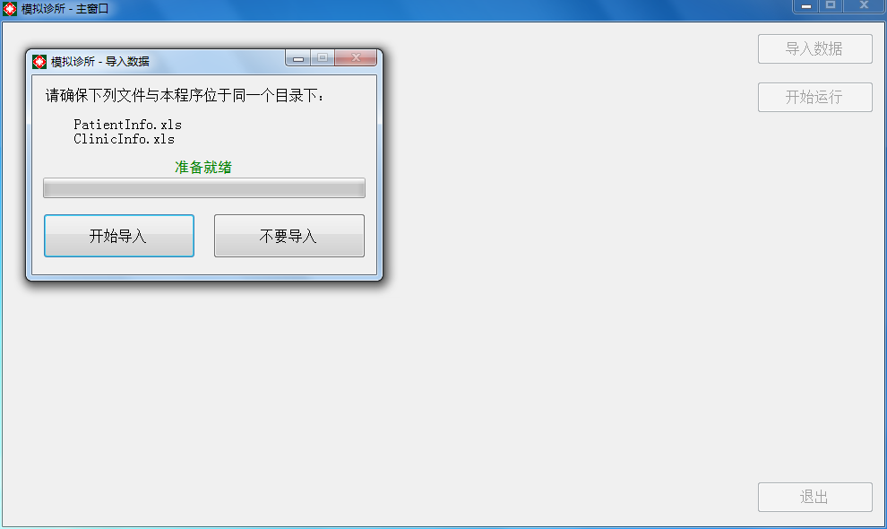
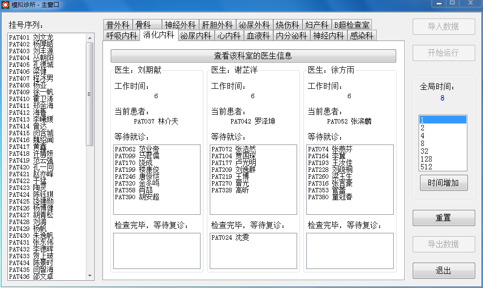

# 模拟诊所

### 1. 设计目标

#### 1.1. 问题

某医院普通门诊拥有科室15个，每个科室3人；B超室一个，有3台B超机。现在需设计一个叫号系统，通过挂号次序，安排每个科室的叫号顺序，各科室在诊断完病人后，根据其是否开具B超检查要求，安排B超室的叫号顺序，并在所有过程中，记录每位医生所看的病人及其听诊时间。

- 需实现挂号过程，医生就诊过程。
- 显示各个科室、B超室目前的排队情况。
- 查看各个医生问诊的所有病人。

#### 1.2. 解决方案

本软件包括一组由15个医生科室、45名医生、1个设备科室、3台设备（B超机）以及479名患者组成的模拟数据，存放在`安装路径\Data\`下。

本软件旨在通过图形交互界面，完成下列功能。

##### 1.2.1. 实时状态显示

用户可以通过增加系统的全局时间，来查看各个时刻的状态，包括：

- 患者挂号序列
- 所有医生的：
  - 工作时间
  - 当前正在问诊的患者
  - 等待就诊的队列
  - 等待复诊的队列
- 所有设备的：
  - 工作时间
  - 当前正在检查的患者
  - 等待检查的队列

##### 1.2.2. 查看可见角色的所有信息

用户双击任何一个患者、医生或设备，便可以查看该角色的所有信息。

##### 1.2.3. 输出各个医生的工作时间和问诊患者列表

用户可以导出本次运行结果，包括所有医生的工作是时间和就诊患者列表等。导出数据存放在桌面上的`DoctorTreat.xls`中。

### 2. 设计思想

#### 2.1. 自底向上的设计思想

设计顺序如下：

- 队列节点类`class SequentialQueue<T>`和性别枚举`enum Sex`。
- 医生类`class Doctor`、设备类`class Device`和患者类`class Patient`。
- 医生科室类`class DoctorDepartment`和设备科室类`class DeviceDepartment`。
- 用户交互界面，包括主窗口类`class FormMain`、输入窗口类`class FormInput`、输出窗口类`class FormOutput`和致谢窗口类`class FormThanks`。

#### 2.2. 面向对象的设计思想

C#.net是面向对象的编程语言，有以下主要特性：

- 没有“全局”的概念，以类作为顶层；
- 所有的类都继承自`class Object`。

这意味着，用该语言制作的所有程序都是面向对象的。

### 3. 构成

整个 Visual Studio 解决方案由三个项目构成：

- 项目SequentialQueueCpp：队列数据结构的C++实现。
- 项目SequentialQueueTest：主项目中队列数据结构的测试。
- 项目SimulatedClinic：主项目。

### 4. 开发平台

- 使用 Microsoft Visual Studio 2013 Ultimate 开发
- 使用 C#.net 语言开发
- 基于 .net Framework 3.5 平台开发

### 5. 运行截图





### 6. 结果分析

本软件可以根据给定的源数据准确地模拟出挂号和排队就诊的过程。

窗体控件的设计给予用户很大的引导性——例如，按钮的设计使得用户只能进行当前允许的操作。同时，窗体的功能分区明确而有序，整体感比较好。

邀请多位同学对本软件进行了使用测试，未发现任何错误或异常。

### 7. 操作说明

#### 7.1. 文件结构

```d
模拟诊所
 |-- 模拟诊所.exe
 |-- NPOI.dll
 └-- Data
      |--ClinicInfo.xls
      └--PatientInfo.xls
```

**本软件包含的所有角色信息纯属虚构，切勿对号入座。**

**为了确保软件正常运行，`安装路径\Data\`下的所有内容不可修改、移动和重命名！作者不保证在改动这些文件的情况下软件仍然能够正常运行。**

#### 7.2. 导入数据

双击位于桌面的“模拟诊所.exe”以运行软件。

首先必须导入模拟过程所需要的数据。单击“导入数据”按钮，然后在弹出的“导入数据”窗口中单击“开始导入”按钮即可。

一般情况下，数据会在2秒钟以内导入完毕，这时单击“返回”按钮便可以回到主窗口。此时，主窗口上的“开始运行”按钮已经可以点击了。

**导入报错？**请先卸载软件，然后将软件重新安装到用户桌面上的一个空文件夹中。

#### 7.3. 运行前必读

##### 7.3.1. 全局时间

全局时间是一个整数，可以被认为是模拟诊所中的时钟。全局时间没有特定的单位。

全局时间的增加代表着模拟诊所中时间的流逝。全局时间不是自动增加的，而是由用户控制的。用户就好比是“上帝”，可以控制模拟诊所中的全局时间流动或静止，当全局时间静止时，用户可以“进入”各个科室，查看当前时刻的状态。

模拟诊所内各个过程所需的全局时间：

- 挂号过程——每1个时间单位，有50位患者完成挂号。
- 医生问诊过程——医生每2-9个时间单位（随机）完成一位患者的初诊和复诊。
- B超检查过程——B超机每4-7个时间单位（随机）完成一位患者的检查。

##### 7.3.2. 就诊流程

就诊流程如下：

1. 患者挂号，此时患者需要提供挂号的科室；
2. 患者挂号完成后，被分配到医生，并进入该医生的“等待就诊”队列；
3. 患者在“等待就诊”队列中等待，直到可以接受初诊；
4. 患者接受初诊；
5. 患者接受初诊之后，被分配到设备，并进入该设备的“等待检查”队列；
6. 患者在“等待检查”队列中等待，直到可以接受检查；
7. 患者接受检查；
8. 患者接受检查之后，被转回初诊医生，并进入该医生的“等待复诊”队列；
9. 患者在“等待复诊”队列中等待，直到可以接受复诊；
10. 患者接受复诊；
11. 患者接受初诊/复诊之后，离开医院。

另外：

- **“等待复诊”队列比“等待就诊”队列优先级高。**也就是说，当医生完成一位患者的问诊之后，优先从“等待复诊”队列中叫下一位患者；
- **就诊流程5-10是非必须的。**也就是说，患者是否需要接受设备检查是随机的。

#### 7.4. 运行

单击“开始运行”按钮，模拟诊所的相关内容就会显示出来。

切换选项卡，便可以查看不同科室的当前状态。

单击“查看该科室的医生/设备信息”，会弹出该科室中医生/设备的详细信息。

主窗口中任何包含患者编号和姓名的地方都可以双击，这时会弹出显示该患者详细信息。

“时间增加”按钮上方的选择框中的数字x表示：单击“时间增加”按钮之后，全局时间增加x个单位。选定之后，单击“时间增加”按钮，全局时间会增大。同时，模拟诊所的状态会发生变化。

全局时间不会无限增大，当最后一名患者“离开”模拟诊所时，全局时间将会定格，“时间增加”按钮也将变为不可用。然而，“导出数据”按钮将变为可用。

可以单击“重置”按钮，使得模拟诊所变为导入数据之后的状态。

#### 7.5. 导出数据与退出

单击“导出数据”按钮，然后在弹出的“导出数据”窗口中单击“开始导出”按钮即可。

一般情况下，数据会在2秒钟以内导出完毕。导出的文件是位于桌面的“DoctorTreat.xls”，里面包括45名医生的全部信息，以及他们问诊患者的所有信息。这时单击“返回”按钮便可以回到主窗口。此时，主窗口上仅有“退出”按钮可以被点击。

**导出报错？**请关闭正在使用“DoctorTreat.xls”的其他软件。

单击“退出”按钮，这是会弹出“致谢”窗口，单击“确定”以退出软件。

本软件使用免费开源的NPOI进行Excel文件的读写操作，这里向NPOI项目团队表示感谢。根据NPOI项目的条款，若在软件中使用到NPOI，则必须在醒目处放置NPOI标志。

### 8. 其他

- 所有".md"文件是用[Typora](http://typora.io)编写的。
- 所有".md"文件的风格是[Github Flavored Markdown](https://guides.github.com/features/mastering-markdown/#GitHub-flavored-markdown)。
- 各行以CRLF（Windows）结尾。
